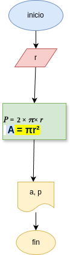

# Programa 1: area_perimetro_circ
programa de python para calcular el área y el perímetro de un circulo, dado el valor de su área

## Análisis

### variables de entrada
- r: radio de circulo
 
## procesamiento 
- a: area del circulo
- p: perimetro de circulo

$a = \pi*r²$
$p = 2*\pi*r$

## Diseño

## Construcción
codigo inplementado en archivo area_perimetro_circ.py
